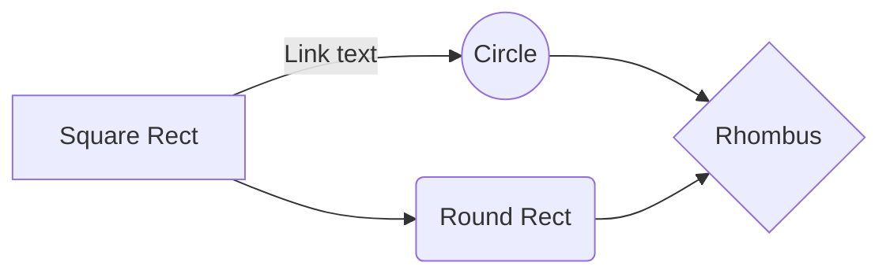

# GitHub

## Markdown Tutorial

- Definition and History of Markdown
 - Markdown is a lightweight markup language with plain-text formatting syntax. It was created in 2004 by John Gruber, with significant contributions from Aaron Swartz. The primary goal was to enable people to write using an easy-to-read and easy-to-write plain text format, which could optionally be converted into HTML (or other formats).


- Purpose and Applications of Markdown
The purpose of Markdown is to offer an easy-to-read, easy-to-write syntax for text formatting, which can be easily converted into HTML or other rich text formats. It's primarily used for writing content on the web, but its simplicity and portability have led to a wide range of other applications, such as:

Documentation: Due to its readability and ease of use, Markdown is often used for writing documentation for software projects.

Blogging: Many bloggers adopt Markdown for writing posts due to its simplicity and the ease of converting text into HTML.

Note-taking: Individuals and teams use Markdown for note-taking because it's quick and doesn't require a rich-text editor.

Technical Writing and Publishing: Writers prefer Markdown for technical topics or e-books due to its straightforward formatting and compatibility with version control systems like Git.

Academic Writing: Researchers and students use Markdown to write papers and reports, especially when combined with tools that can convert Markdown to formats like PDF or LaTeX.

Advantages of Using Markdown
Simplicity: Markdown's syntax is straightforward, making it easy to learn and use, even for people without any background in web development or programming.

Portability: Being a plain-text format, Markdown files are lightweight and can be opened, edited, and shared across virtually any platform or device.

Readability: Unlike HTML or other markup languages, Markdown is designed to be as readable as possible in its raw form, making collaboration and editing easier.

Flexibility: Markdown can be converted to many other formats (like HTML, PDF, and Word), making it a versatile choice for various content creation needs.

Integration with Version Control Systems: Markdown works well with version control systems like Git, which makes it an excellent option for collaborative writing and documentation in software development.

Extensibility: There are many "flavors" of Markdown that add additional features (like tables, footnotes, and strikethroughs), allowing users to choose the one that best suits their needs.

Widespread Adoption: Due to its advantages, Markdown has been widely adopted, and there are numerous tools and editors available to work with it.

This tutorial introduces you to Markdown, providing a foundation for learning its syntax and exploring its applications in various domains. As you progress, you'll find that Markdown is a valuable skill, especially in areas involving writing and documentation.

Basic Syntax in Markdown
Understanding the basic syntax of Markdown is essential for anyone looking to format text efficiently. Here's a breakdown of the fundamental elements:

1. Headers
Headers in Markdown are created using the # symbol followed by a space. The number of # symbols used indicates the level of the header:

# Header 1

## Header 2

### Header 3

#### Header 4

##### Header 5

###### Header 6

Each level represents a decreasing size of the header, with Header 1 being the largest.

2. Paragraphs and Line Breaks
Paragraphs: To create a paragraph, simply type your text and leave a blank line between paragraphs.

Line Breaks: If you need a line break without starting a new paragraph, end a line with two or more spaces and then hit Enter.

3. Emphasis
Italic: To italicize text, enclose it in one asterisk (*) or underscore (_). For example, *italic* or *italic*.

Bold: For bold text, use two asterisks (**) or underscores (__). Example: **bold** or **bold**.

4. Lists
Unordered Lists: Use asterisks (*), plus signs (+), or hyphens (-) for bullet points.

* Item 1
* Item 2
  * Subitem 2.1
  * Subitem 2.2

Ordered Lists: Simply start each line with a number followed by a period.

1. First Item
2. Second Item
   1. Subitem 2.1
   2. Subitem 2.2

5. Links
To add a hyperlink, enclose the link text in square brackets ([ ]), and then follow it immediately with the URL in parentheses (( )). For example:

[OpenWTCC](https://www.https://www.waketech.edu/)

This will create a clickable link: OpenWTCC

6. Images
Inserting images is similar to links. Start with an exclamation mark (!), followed by the alt text in square brackets, and the image URL in parentheses.

Advanced Formatting in Markdown
Once you're comfortable with the basic syntax of Markdown, you can enhance your documents with more advanced formatting elements. Here's a guide to some of the advanced formatting options in Markdown:

1. Blockquotes
Blockquotes are used to indicate that a section of text is a quote. You create a blockquote by starting a line with the > character, followed by a space. For example:

> This is a blockquote.

You can also nest blockquotes by adding additional >:

> This is the first level of quoting.
>
>> This is a nested blockquote.

2. Code Blocks and Inline Code
For coding purposes, Markdown supports both inline code and code blocks.

Inline Code: Use backticks (`) to create inline code. For example,`print("Hello World")` will render as print("Hello World").

Code Blocks: For larger snippets, enclose your code between triple backticks (```). Optionally, you can specify the programming language right after the first triple backticks for syntax highlighting:

```python
def hello():
    print("Hello, World!")

3. Tables
Markdown allows you to create simple tables using hyphens (-) and pipes (|). The hyphens are used to create column headers, and the pipes separate each column. For example:

| Header 1 | Header 2 | Header 3 |
|----------|----------|----------|
| Row 1    | Data     | Data     |
| Row 2    | Data     | Data     |

This will create a table with three columns and two rows of data.

4. Horizontal Rules
Horizontal rules (thematic breaks) are useful for separating sections of text. You can create a horizontal rule by placing three or more asterisks (***), hyphens (---), or underscores (___) on a new line. For example:

This is some text above the rule.
---
This is some text below the rule.

With these advanced formatting tools, you can create more structured and visually appealing Markdown documents. Whether you're writing technical documentation, academic papers, or just organizing notes, these features will enhance the readability and organization of your content. Remember, the power of Markdown lies in its simplicity and the ability to format text in a way that's both readable and aesthetically pleasing.

Markdown Flavors, Editors, Converters, and Best Practices
Markdown, while simple and consistent in its core, has various "flavors" that add extended functionality. Understanding these, along with the tools available for Markdown editing and conversion, can greatly enhance your Markdown experience.

Markdown is used almost everywhere, from GitHub to Slack. It's the unofficial text writing and formatting standard on big coding sites, like coding repositories. Most engineering readme files are written with and formatted using Markdown.

Markdown Flavors
GitHub Flavored Markdown (GFM): This is a popular Markdown flavor used on GitHub. It adds features like task lists, tables, and fenced code blocks (with optional language-specific syntax highlighting). 

What is a GitHub Markdown?

Quickstart for writing on GitHub - GitHub Docs

You can use Markdown syntax, along with some additional HTML tags, to format your writing on GitHub, in places like repository READMEs and comments on pull requests and issues.

Additional Resources: Markdown Cheatsheet

Creating Markdown files in VS Code (plain text: https://code.visualstudio.com/Docs/languages/markdown)

Creating Diagrams using Markdown.  

Mermaid is a Markdown-inspired tool that renders text into diagrams. For example, Mermaid can render flow charts, sequence diagrams, pie charts and more. For more information, see the Mermaid documentation.

To create a Mermaid diagram, add Mermaid syntax inside a fenced code block with the mermaid language identifier. For more information about creating code blocks, see "Creating and highlighting code blocks."

Using VSCode for Mermaid.  How to Create Diagrams as Code with Mermaid, GitHub, and Visual Studio Code (Plain Text: https://www.freecodecamp.org/news/diagrams-as-code-with-mermaid-github-and-vs-code/)

** PyCharm also supports both Mermaid and Markdown.

Each flavor maintains the core principles of Markdown but adds unique features that might be beneficial depending on your use case.

Markdown Editors and Converters
Editors:

MarkdownPad (Windows): A full-featured Markdown editor with live preview and customizable themes.
Typora (Cross-platform): Offers a seamless live preview and a clean interface, making it easy for beginners and advanced users.
Visual Studio Code (Cross-platform): While primarily a code editor, it has excellent Markdown support with extensions for additional functionality.
Atom (Cross-platform): A hackable text editor from GitHub, which supports Markdown editing and previewing.
Converters:

Pandoc: A powerful command-line tool that can convert Markdown to various formats including HTML, PDF, and Word.
Marked 2 (Mac): An app for previewing and exporting Markdown documents in various formats.
Online converters like Dillinger or Markdown to HTML are useful for quick conversions without installing software.
Best Practices and Tips
Consistency: Stick to a consistent style for headers, lists, and other elements to keep the document tidy.
Whitespace: Use appropriate spacing (like new lines before headers and lists) for better readability in the source code.
Descriptive Links: Use meaningful text for hyperlink descriptions rather than generic phrases like "click here."
Version Control Compatibility: Write with line breaks that make sense for easy tracking of changes in version control systems.
Working with Markdown Files in VS Code
This guide will walk you through setting up Visual Studio Code (VS Code) for an enhanced Markdown editing experience, including support for Mermaid diagrams. 

Configuring VS Code for Markdown 
Step 1: Install Visual Studio Code 

Download and install VS Code from the official website. 

Step 2: Open VS Code 

Launch VS Code to get started. 

Step 3: Access the Extensions Marketplace 

Click on the Extensions icon in the left sidebar or press Ctrl+Shift+X (Windows/Linux) or Cmd+Shift+X (macOS). There also may be an Icon on top right. 

Step 4: Install Markdown Extensions 

Markdown All in One 

Functionality: Keyboard shortcuts, TOC generation, auto preview, and list editing. 

Install: Search "Markdown All in One" and click 'Install'. 

Markdown Preview Enhanced 

Functionality: Advanced Markdown preview with styles, LaTeX, and mermaid diagrams. 

Install: Search "Markdown Preview Enhanced" and click 'Install'. 

markdownlint 

Functionality: Linting for consistent Markdown styling. 

Install: Search "markdownlint" and click 'Install'. 

Step 5: Configure Extensions (Optional) 

Customize settings by going to File > Preferences > Settings (Windows/Linux) or Code > Preferences > Settings (macOS). 

Step 6: Use Markdown Features 

Utilize the installed extensions for an improved Markdown experience. 

Step 7: Explore and Experiment 

Experiment with the features of each extension to suit your workflow. 

Adding Mermaid Support in Markdown 
Step 1: Ensure Prerequisites 

Ensure VS Code and essential Markdown extensions are installed. 

Step 2: Install Markdown Preview Enhanced 

This extension is necessary for Mermaid support. 

Step 3: Use Mermaid in Markdown 

Create diagrams using the Mermaid syntax in your Markdown files. Example: 

# Showing mermaid 



Step 4: Preview Mermaid Diagrams

With the Markdown file open, press `Ctrl+K V` (Windows/Linux) or `Cmd+K V` (macOS) for a side-by-side preview.  There also may be an Icon on top right.

 Step 5: Customize Preview (Optional)

Adjust settings for custom themes or styles as needed.

 Step 6: Explore Mermaid Syntax

Learn more about Mermaid diagram types and syntax on their [official website](https://mermaid-js.github.io/mermaid/).
